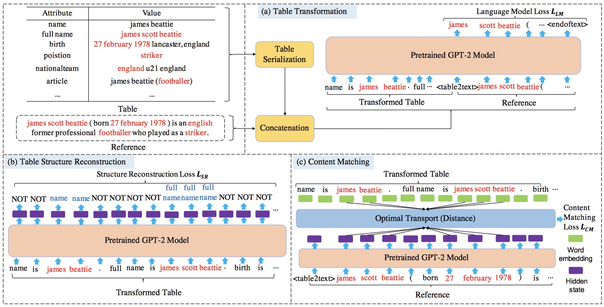

# TableGPT
## Description
This repo contains document-level code for [TableGPT: Few-shot Table-to-Text Generation with Table Structure Reconstruction and Content Matching](https://www.aclweb.org/anthology/2020.coling-main.179/). It is based on the extremely awesome repository from HuggingFace team [Transformers](https://github.com/huggingface/transformers). 
## Architecture

